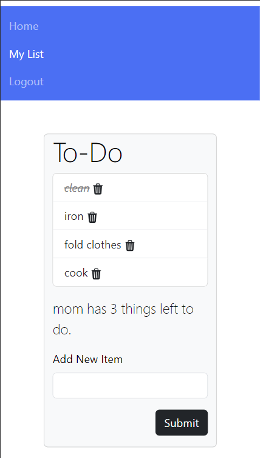

# Getting Things Done
This is a full-stack application with local authenitcation to track users' to-do lists. 

---

**Link to project:** [Getting Things Done]()

---

## How It's Made:

**Tech used:** 
bcrypt, connect-mongo, dotenv, ejs, express, express-flash, express-session, mongodb, mongoose, morgan, nodemon, passport, passport-local, validator, node, bootstrap

---

## Optimizations
Adding a toggle setting for color themes (light/dark mode), making multiple to-do lists per user. 

---

## Lessons Learned:

Even if you are trying something brand new, the best way to learn is to build, build, build!

---

